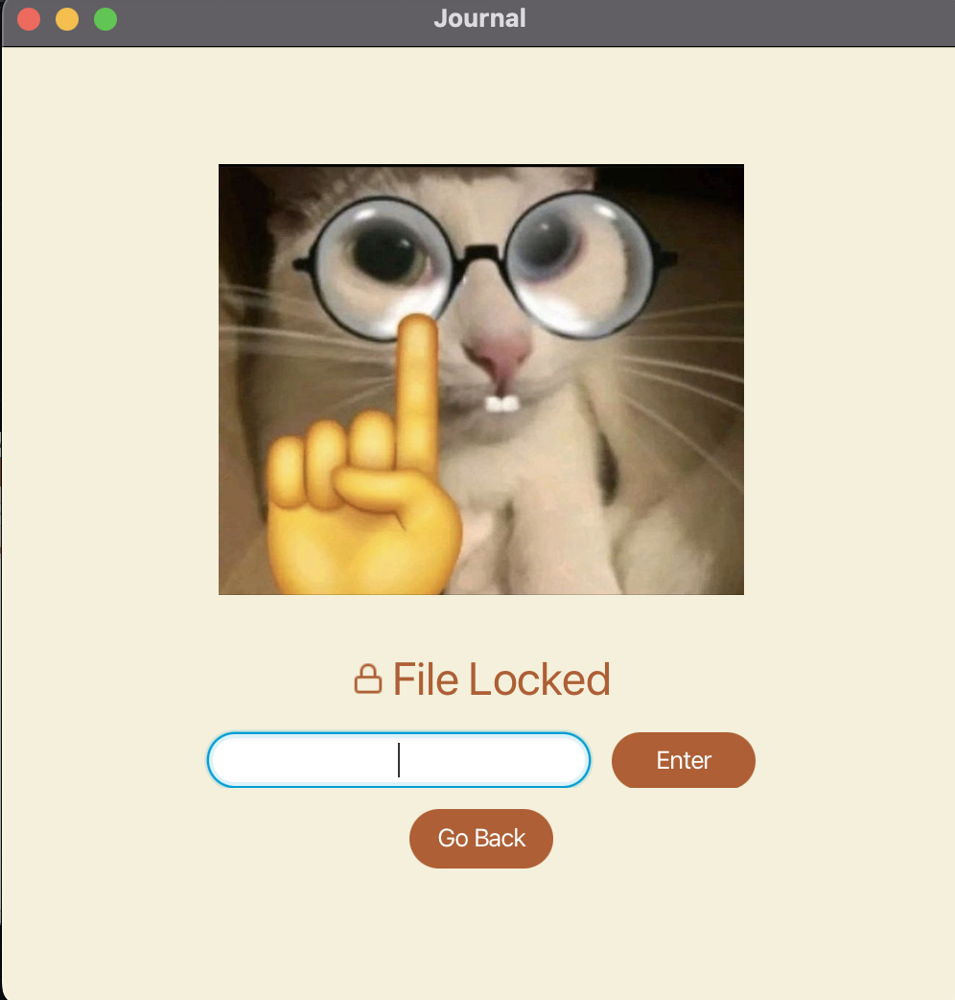

# 3500 PA05 Project Repo

[PA Write Up](https://markefontenot.notion.site/PA-05-8263d28a81a7473d8372c6579abd6481)

## Welcome Page version:

## Journal Page:

## Vertical View:

## Privacy Screen:

## Add Task & Events:

## Shortcuts:

## Save Screen

## Save as an Template:

# Pitch:

Meow Meow. Java Journal by developer group hog-rider-meow-meow is a one of a kind cat themed bullet journal app.
Create tasks and events in an organized layout at the click of a button (because we implemented shortcuts).
It also features commitment warnings, task queue, progress bars, privacy locks, multiple layout options
and much more! If you like cats or being organized this app will be a wonderful addition to your life.

# SOLID

**Single Responsibility**: We followed the single responsibility principle by following the MVC
architecture and separating abstracting behaviors using interfaces. For example, we had individual
controllers handle a specific part of the SceneBuilder, such as a Screen or a Popup. Our model also had individual
representations for each
object/piece of information we had to store including separate representations for Json Records for serialization.
For functionality, we made Util classes that were each responsible for handling more miscellaneous tasks such as parsing
Finally, we had individual views that handled displays for each unique window/scene that loaded scenes from SceneBuilder

**Open/Closed**: We designed our program to be open for extension and closed for modification by abstracting out
similar behaviors like tasks and events. If we wanted to create a new type of item to add to our journal we could
simply extend the AbstractJournalItem class, and it would still be able to be stored and saved into a bujo file
by our program. In addition, we had interfaces representing a specific type of component, such as a Popup, which allowed
to easily create different types of Popups by simply impements that interface. We used that many times to create
different sorts of pop ups and error/success messages throughout or application.

**Liskov Substitution**: An example of how we followed Liskov Substitution is with our view classes. Each one of our
view classes implement GuiView which only has one method, load(). Subsequently, each of the classes that
implement GuiView also only has the load() method and throws no additional exceptions, allowing GuiView to be
able to be replaced by any of its subclasses without issue.

**Interface Segregation**: An example of when we used interface segregation can be seen in our controller classes.
We have two interfaces in our controller package, JournalScreenController, and PopupController. While both have the
method start(), PopupController has the method showHandler() which specifically handles showing the popup as a response
to it being opened from a button click for example. Originally, we had just the Journal interface, but we realized that
the Popups needed a showHandler method to display the popup, but adding the showHandler method to the Journal interface
would violate this principle, since some of the JournalScreens are not popups, which is why we segregated these
interfaces.

**Dependency Inversion**: One way we followed dependency inversion was how we implemented our views. Each of our views
requires a controller in order to use the setController() method in FMXL loader. To take advantage of the dependency
inversion principle we
made the view take in an interface rather than the specific type of object,
since by using abstractions for high level modules such as the view, we can
allow for more flexibility in the view.

# How we could add a new feature

One feature we could extend our code to add is categories from section 2.
We can do this by taking advantage of our design and the open/closed principle to add a category without modifying the
AbstractJournalItem and
Task/Event classes at all. We would make an interface called JournalItem and have the abstract class implement that
class. Then we could create a new class that also implements the interface, and have it use composition to hold an
AbstractJournalItem as a field, and have another field as a category, as a class, as we'd be able to color code and
maintain existing categories easily/add any interesting features. We would have to refactor our code to take in the
interface (depenedency inversion principle) instead of the abstract class, but everything should be implemented
relatively easily. In the AddPopupController class, where the user adds a task/event,
we would have a dropdown that represents existing categories, or the option to create a category, and from there, with
out existing code we could simply add an if statement to determine if a category is selected, and then use the
previously created object and instead return the CategorizedObject that has-a Task/Event and put it into the calendar
view.

# Running JAR file
[Jar File](https://github.com/CS-3500-OOD/pa05-hog-rider-meow-meow/blob/main/catCalender.jar)

Right click catCalender.jar &rarr; go to "More Run/Debug" &rarr; click "Modify Run Configuration..."

For windows: enter

`--module-path modules/windowModules/lib --add-modules javafx.fxml --add-modules javafx.controls`

into VM options

For mac: enter

`--module-path modules/macModules/lib --add-modules javafx.fxml --add-modules javafx.controls`

into VM options.

Then click Run 'catCalender.jar'

# Image sources

Another day another slay cat: https://www.instagram.com/p/CkGtsltpYme/

Batman cat: https://twitter.com/me1oby/status/1664672797610614784

Yakult cat: https://www.instagram.com/reel/CnsEzyVKLUF/?igshid=MDJmNzVkMjY%3D

Messi cat: https://www.facebook.com/FCBUniverse/posts/ten/3410848985867492/

Nerd cat: https://www.instagram.com/p/CsRlbiFJVOD/?utm_source=ig_web_copy_link&igshid=MzRlODBiNWFlZA==

Splash screen
gif: https://media3.giphy.com/media/6Rilq97mKJhbaaM1xs/200w.gif?cid=6c09b952w4s1vrl65fbyw2vkro0rzjgzv9xumgskq1mbhjlb&ep=v1_gifs_search&rid=200w.gif&ct=g

Crying banana cat: https://media.tenor.com/u8M7kk5ZXmwAAAAC/banana-cat-crying.gif

Icon: https://github.com/feathericons/feather
